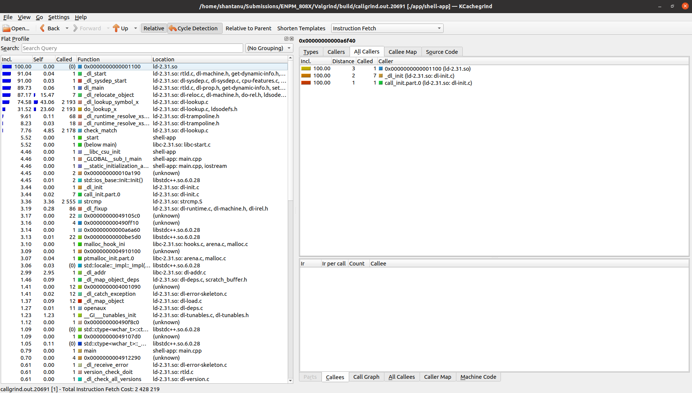

# Valgrind Exercise
Author- Shantanu Parab sparab@umd.edu
***

### Errors
1. **Uninitialized identifier used:**  
terminator was used without initialization
2. **Memory leak:**  
Objects AnalogSensor **lightSensor** and vector **readings** created were not deleted.

***
### Solutions
1. Initialized terminator.
2. Called Destructor for Analog Sensor
Deleted the object vector after use.

***
### File Structure for Submission  

<pre>├── <b>valgrind</b>
│   ├── <b>Kcachegrind.png</b>
│   ├── result_before_solving.txt
│   └── results_after_solving.txt
</pre>
***
### Kcachegrind Output  
</img>
